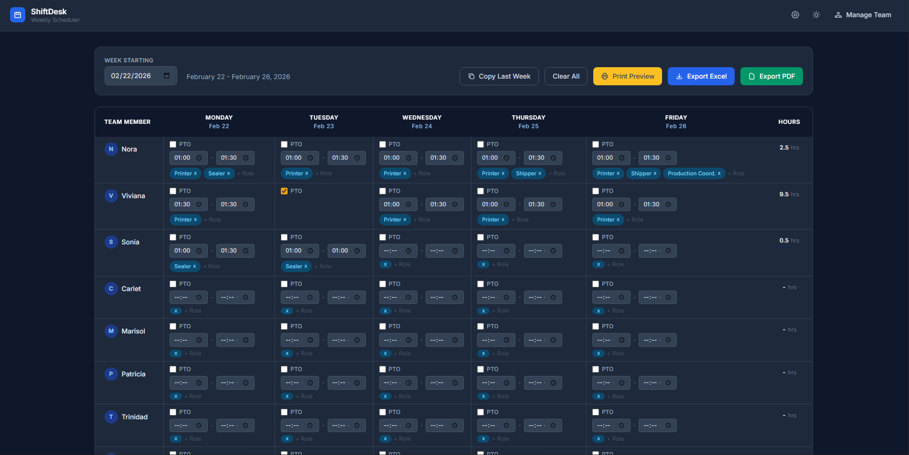

# ShiftDesk 📅
A clean, modern weekly work schedule builder with PDF and Excel export.

Built with Flask and Tailwind CSS. Designed to be simple enough for anyone to use — no training required.




---

## Features

-  Build weekly schedules for your entire team in one view
-  Native time pickers — no more typing "9:00 AM" by hand
-  Add multiple roles per shift as tags (press Enter to add)
-  Mark employees as PTO with one checkbox
-  Auto-calculates total hours per employee
-  Date headers update automatically when you pick a week
-  Remembers last week's schedule when you reopen the app
-  Export to Excel (.xlsx) or PDF with one click
-  Add or remove team members from a dedicated management page

---

## Getting Started

### Option A — Download the App (Windows, no setup needed)

1. Go to the [Releases](../../releases) page
2. Download `SchedulePlanner.exe`
3. Double-click to run — it opens in your browser automatically

No Python, no installation, no command line needed.

---

### Option B — Run from Source (developers)

**Requirements**
- Python 3.11+
- pip

**Install**

```bash
git clone https://github.com/Kramberry/schedule_app.git
cd schedule_app
pip install -r requirements.txt
```

**Run**

```bash
python app.py
```

Then open your browser to `http://127.0.0.1:5000`

---

## How to Use

1. **Pick a week** using the date picker at the top
2. **Fill in shifts** — set start/end times and type role names, pressing Enter to add each one
3. **Mark PTO** by checking the PTO box for that employee/day
4. **Export** using the Excel or PDF button when done
5. **Manage your team** by clicking "Manage Team" in the top right to add or remove employees

---

## Project Structure

```
schedule_app/
├── app.py                  # Flask backend — all routes and logic
├── employees.json          # Saved list of team members
├── requirements.txt        # Python dependencies
├── app.ico                 # App icon
├── app.spec                # PyInstaller config (for building .exe)
└── templates/
    ├── schedule_form.html  # Main scheduling UI
    └── employees.html      # Team management page
```

---

## Dependencies

| Package | Purpose |
|---|---|
| Flask | Web framework |
| pandas | Schedule data handling |
| openpyxl | Excel export |
| reportlab | PDF export |

Install all at once:
```bash
pip install -r requirements.txt
```

---

## Building the .exe (Windows)

To package the app as a standalone executable:

```bash
pip install pyinstaller
pyinstaller app.spec
```

The output will be in the `dist/` folder as `SchedulePlanner.exe`.

---

## Roadmap

- [ ] Dark mode toggle
- [ ] Copy last week's schedule with one click
- [ ] Hide employees with no shifts
- [ ] Cloud hosting so no download is needed
- [ ] Login system for multiple users

---

## Author

Built by **Brandon** for internal team scheduling.
Feel free to fork and adapt for your own team!
