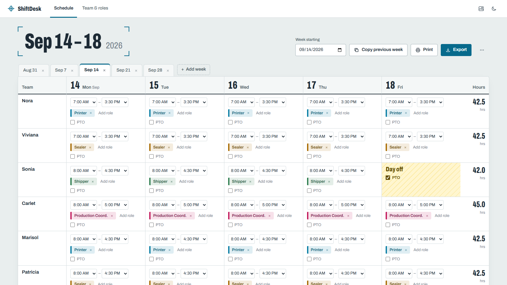

# ShiftDesk 📅
A clean, modern weekly work schedule builder with PDF and Excel export.

Built with Flask and plain HTML/CSS, styled like a shop-floor planning board. Designed to be simple enough for anyone to use — no training required.




---

## Features

-  Build weekly schedules for your entire team in one view
-  Work on several weeks at once in tabs, and copy the previous week in one click
-  Time pickers in 30-minute steps — no typing "9:00 AM" by hand
-  Roles as colour-coded tags; each role has its own colour on screen and on paper
-  Mark a day off (PTO) with one checkbox — it counts as 8 hours
-  Auto-calculates total hours per person
-  Print preview, or export every open week to Excel (one sheet per week) or PDF
-  Export any earlier saved week from the archive
-  Manage the team and the shared roles list on one page, with undo for removals
-  Light and dark mode, remembered between visits

---

## Getting Started

### Option A — Download the App (Windows, no setup needed)

1. Go to the [Releases](../../releases) page
2. Download `app.exe`
3. Double-click to run — it opens in your browser automatically

No Python, no installation, no command line needed.

---

### Option B — Run from Source (developers)

**Requirements**
- Python 3.11+
- pip

**Install**

```bash
git clone https://github.com/Kramberry/schedule_app.git
cd schedule_app
pip install -r requirements.txt
```

**Run**

```bash
python app.py
```

Then open your browser to `http://127.0.0.1:5000`

---

## How to Use

1. **Pick a week** with the "Week starting" date, or click **Add week** to open the following week in a new tab
2. **Fill in shifts** — set start/end times, then type a role and press Enter (or pick one from the list)
3. **Mark a day off** by ticking PTO for that person and day
4. **Reuse last week** with **Copy previous week**, then change whatever is different
5. **Print** or **Export** (Excel or PDF) when done — Export includes every open week tab
6. **Manage your team and roles** from **Team & roles** in the top bar

---

## Project Structure

```
schedule_app/
├── app.py                  # Flask backend — all routes and logic
├── employees.json          # Saved list of team members
├── requirements.txt        # Python dependencies
├── app.ico                 # App icon
├── app.spec                # PyInstaller config (for building .exe)
└── templates/
    ├── schedule_form.html  # Main scheduling board
    ├── employees.html      # Team & roles page
    ├── multi_export.html   # Export earlier saved weeks
    ├── print_preview.html  # Printable schedule
    ├── _theme.html         # Shared colours, type and components
    ├── _topbar.html        # Shared top bar
    ├── _banners.html       # Optional side-banner pictures
    └── _confirm_modal.html # In-page confirmation box
```

---

## Dependencies

| Package | Purpose |
|---|---|
| Flask | Web framework |
| openpyxl | Excel export |
| reportlab | PDF export |

Install all at once:
```bash
pip install -r requirements.txt
```

---

## Building the .exe (Windows)

To package the app as a standalone executable:

```bash
pip install pyinstaller
pyinstaller app.spec
```

The output will be in the `dist/` folder as `app.exe`.

---

## Roadmap

- [x] Dark mode toggle
- [x] Copy last week's schedule with one click
- [ ] Hide employees with no shifts
- [ ] Cloud hosting so no download is needed
- [ ] Login system for multiple users

---

## Author

Built by **Brandon** for internal team scheduling.
Feel free to fork and adapt for your own team!
